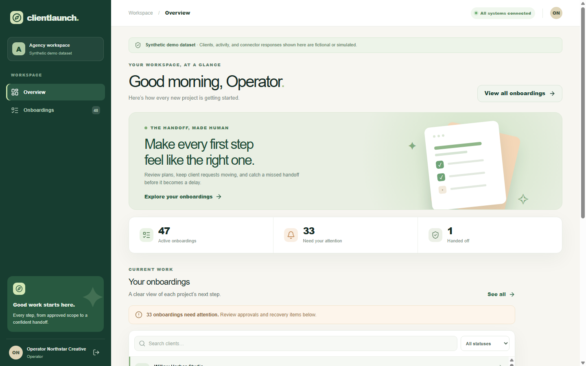

# ClientLaunch

> A controlled handoff from won deal to client onboarding.



[Getting started](#getting-started) · [Architecture](docs/ARCHITECTURE.md) · [Evaluation](docs/EVALUATION.md) · [Security](docs/SECURITY.md)

## Overview

ClientLaunch is a self-hosted agency onboarding pilot. A signed won-deal event becomes a reviewed plan, a project folder, a Trello-style board with checklist cards, a scoped client portal, and a tracked delivery handoff. n8n coordinates the business workflow; FastAPI owns business state and permissions; a separate LangGraph service drafts the plan; React provides the operator and client interfaces.

**Synthetic demo dataset.** All included organizations, contacts, documents, and outcomes are fictional. The demo uses local Drive, Trello, and mail simulators and a deterministic AI fixture. It sends no external messages. The connected adapters require customer-controlled credentials and authorized recipients.

### Core workflow

**Won deal → reviewed plan → folder and board → client portal → delivery handoff**

### Capabilities

- n8n-owned business coordination and retries
- Human-reviewed onboarding plan
- Scoped client portal and delivery checklist

### Technology

n8n · FastAPI · React · LangGraph · PostgreSQL

### Evidence and scope

Local workflow, API and browser checks are documented; connected Drive, Trello and mail adapters still require authorized live verification. The included demo uses synthetic data and local simulators. Deployment and live-provider limits are documented in [implementation status](docs/IMPLEMENTATION_STATUS.md).

## Getting started

Run the local demonstration from the repository root using the project-specific instructions below. External service credentials are needed only for connected integrations.

### Quick start

Prerequisites: Docker Desktop or Docker Engine with Compose, and Node.js 24 or newer. Start Docker first. From this folder, run one command:

```powershell
node scripts/demo.mjs
```

The same command works in a POSIX shell. On first run it creates an ignored `.env` with random local secrets, builds the containers, applies PostgreSQL migrations, loads the full synthetic dataset, imports the ten pinned n8n workflows, verifies their IDs, and publishes only demo workflows plus the demo reminder and pending-dispatch schedules. The generated operator password is printed once and stored in `.env`. A fresh n8n instance also gets the local owner `n8n-demo@clientlaunch.example.com`; its generated password is stored in `.env`. `scripts/demo.mjs` refuses to run with `CONNECTOR_MODE=connected` and limits Compose build parallelism to reduce CPU load.

Open the portal at <http://localhost:8080>. The operator email is `operator@northstar.example.com`. The business API is at <http://localhost:8018>; n8n is at <http://localhost:5678>. The internal AI service is exposed on loopback port 8021 for local diagnostics. Change all generated secrets and configure HTTPS before any customer deployment.

To replay the synthetic website handoff through the signed n8n webhook after launch, run `node scripts/replay_won_deal.mjs --case website-002 --repeat`. The `--conflict` flag resends the same event ID with altered scope to exercise rejection. A Python equivalent is also available at `scripts/replay_won_deal.py`. The fixture is at `fixtures/won_deal_website.json`; replay is local-only and creates demo state.

The one-command local Docker launch completed on 2026-09-28: five services started, PostgreSQL migration `0003` and the full seed loaded. After a brief Docker Desktop interruption, a ten-workflow, **94-node** pack was imported and published with five webhook routes; API and n8n health returned HTTP 200. Signed intake through n8n returned 200; an identical replay returned 200 with the same onboarding, while a conflicting replay returned 409. The user-authorized Willow Harbor Studio DEMO plan was approved once. A one-shot simulated board failure left its root and seven child folders intact. Operator recovery retried the board operation; the running n8n workflow then created one board, six cards and one welcome outbox entry. The onboarding reached `waiting_for_client` with nine successful provisioning operations and no failed operation. A scoped client submission then completed five of six checklist items and synced their cards; the logo asset remains open. The latest **96-node source pack** adds a controlled reminder webhook and card reconciliation; it passes static validation but has **not** been reimported because Docker overlayfs returned an I/O error. New handoff detail, stale-dispatch recovery and connected-startup checks have local source/test evidence only. Captures at 1440, 1024 and 390 pixels are saved under `screenshots/`. Logo upload, reminder and handoff acceptance, plus connected-provider smoke tests, are tracked in [RUNTIME_ACCEPTANCE.md](docs/RUNTIME_ACCEPTANCE.md). Both PostgreSQL databases previously passed an isolated dump/restore count check before migration `0003` and the tenth workflow import.

The current API suite passes **17/17** tests. Recent source changes hide invite links and token-bearing welcome bodies from viewer accounts, preserve an in-flight card write when a client changes an answer, require a card claim to match its expected status and idempotency key, and require a confirmed To Do list ID when a connected board is reconciled. The operator UI collects that ID and passes typecheck. These changes have local test evidence; the latest Docker runtime journey is still pending.

## Local checks without Docker

With Python 3.12 dependencies installed from `requirements.lock` and frontend dependencies installed from `apps/web/pnpm-lock.yaml`:

```powershell
python -m unittest discover -s tests/ai -p "test_*.py"
python -m unittest discover -s tests/api -p "test_*.py"
python scripts/validate_workflows.py
python evals/validate_dataset.py
cd apps/web
pnpm build
pnpm test
```

`node scripts/bootstrap_n8n.mjs` imports and verifies the workflow pack while leaving it unpublished. `node scripts/bootstrap_n8n.mjs --publish-demo --enable-demo-schedule` publishes local demo triggers only when `CONNECTOR_MODE=demo` is configured. Imports overwrite matching IDs in the target n8n database; use a dedicated installation. Connected API startup requires `APP_MODE=CONNECTED`, `MODEL_MODE=connected`, two distinct non-demo secrets of at least 32 characters (`INTERNAL_KEY`, `WEBHOOK_SECRET`) and `COOKIE_SECURE=true`.

## Documentation

Start with [PRODUCT.md](docs/PRODUCT.md), [ARCHITECTURE.md](docs/ARCHITECTURE.md), [OPERATIONS.md](docs/OPERATIONS.md), and [API.md](docs/API.md). [EVALUATION.md](docs/EVALUATION.md) explains measured synthetic results and leakage limits. [COMMERCIALIZATION.md](docs/COMMERCIALIZATION.md) covers installation scope and connector ownership. [HANDOVER.md](docs/HANDOVER.md) lists verified, pending, and blocked items.

This is an independent portfolio project and a commercial pilot starting point, not a production-ready or customer-validated deployment.

