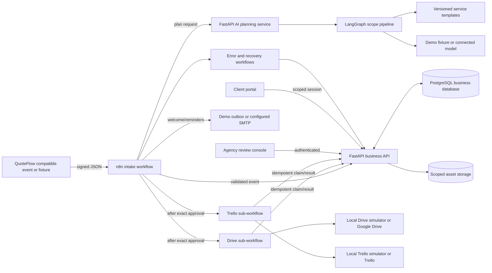
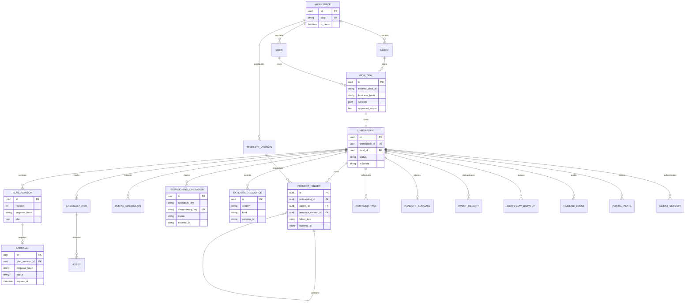

# Architecture

**Design snapshot:** 2026-09-28. Runtime behavior must be confirmed against the tests and execution evidence in [EVALUATION.md](EVALUATION.md).

## Responsibility boundary

n8n owns triggers, branching, connector calls, schedules and error routing. The API owns business state, authorization, approvals and idempotency claims. The AI service owns a typed planning result and no business side effects. The browser calls the API; it never receives n8n credentials. Viewer detail omits the invite link and token-bearing welcome body. n8n internal tables and application tables use separate databases or schemas.

## Workflow and data movement

The pack has ten exports: `intake`, `provision`, `drive`, `trello`, `task_sync`, `submission`, `reminder`, `recovery`, `dispatch_sweeper`, and `error`. `task_sync` coordinates board task updates after provisioning and changed client submissions. The latest source adds task-card reconciliation and an authenticated reminder-run webhook; its 96-node export passed static validation but has not been imported into the local n8n instance. `workflows/manifest.json` declares import order, stable source IDs, dependencies and credential placeholders. Approval, submission and recovery dispatches are stored in `workflow_dispatches` before a best-effort webhook push. In DEMO, the `dispatch_sweeper` schedule reads up to 20 pending rows every five minutes, records an attempt, routes each kind to its authenticated n8n webhook, and acknowledges a row only after the webhook returns HTTP 2xx. Pending rows with fewer attempts take priority, so repeated failures cannot indefinitely hide newer work. The API checks delivered dispatches older than five minutes against business state, requeues only safe incomplete work and blocks replay when provider or welcome-email outcomes could be uncertain. A connector write first claims `provisioning_operations`; the root folder and board are recorded in `external_resources`, while each service/template child folder is recorded in `project_folders`. The approved plan freezes folder names and template versions. n8n creates each child only after its parent has a confirmed external ID. An ambiguous result moves to an uncertain state for operator reconciliation.

The AI graph is a fixed six-node pipeline: parse scope → retrieve templates → extract evidenced items → identify missing inputs/risks → draft plan/welcome → validate against purchased services. It uses LangGraph for an inspectable sequence; it does not run an autonomous agent loop. `MODEL_MODE=demo` uses deterministic fixtures; `MODEL_MODE=connected` requires a configured model and API key. A PostgreSQL checkpointer is optional in the service configuration; its presence does not itself schedule abandoned work.

Task-card claims carry the expected desired status and idempotency key from the pending snapshot. The API rejects a stale claim, preserves claimed/unknown provider writes while newer client answers change the desired state, and schedules the later update only after the original provider outcome is known. A connected board reconciled from a provider lookup must include both its external board ID and verified To Do list ID. These latest source changes have local test evidence but not a rerun through the unimported 96-node pack.

## Core lifecycle

`received → planning → awaiting_approval → provisioning → waiting_for_client → ready → handed_off`. `paused` and `failed/recovering/uncertain` substates suspend ordinary advancement. Plan changes create a new revision/hash; an old approval cannot authorize a new plan. Leaving `provisioning` requires the root folder, every frozen service folder, and the board. Readiness also requires a welcome record and every required checklist row completed. A changed answer may return a checklist row to `needs_review`.

## Business entity relationships

The diagram groups some ancillary fields for readability. Actual columns and constraints are in `apps/api/models.py`; no migration has been inferred from this diagram.

## Failure invariants

- `(workspace_id,event_id)` and `(workspace_id,external_deal_id)` constrain webhook replay; a conflicting payload is rejected.
- `(onboarding_id,operation_key)` and provider idempotency keys constrain repeated provisioning. External timeouts can still be ambiguous, so reconciliation precedes another write.
- Approvals bind revision ID and content hash, expire, and move from pending once.
- Client sessions resolve one onboarding; file metadata is workspace and onboarding scoped. File download rechecks the caller.
- Timeline entries describe observable state/events and avoid invented private model reasoning.

## Deployment boundary

The recommended local pilot is single-process n8n, PostgreSQL, business API, AI service, React frontend, and local connector simulators. Queue mode, Redis, public multi-tenant access and enterprise n8n features are outside this version. The business database, n8n database, asset volume and n8n encryption key are separate backup concerns. See [OPERATIONS.md](OPERATIONS.md).

## Source-based references

The n8n team documents [sub-workflow input/output behavior](https://docs.n8n.io/build/flow-logic/break-workflows-into-smaller-parts), [error workflows](https://docs.n8n.io/build/flow-logic/handle-errors-gracefully), and [workflow export/import](https://docs.n8n.io/build/manage-workflows/export-and-import). The ten-workflow pack was imported locally; the latest dispatch-attempt change and complete downstream scenarios still need triggered runtime verification.
